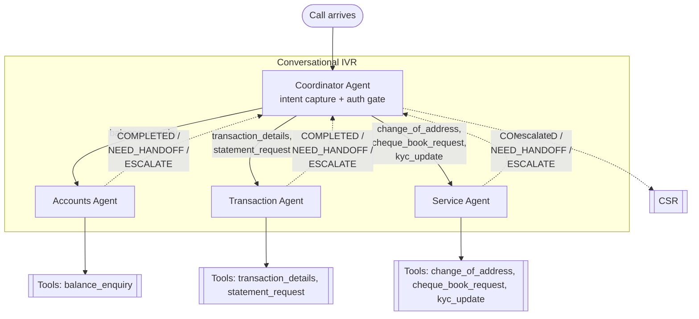

# Agent Architecture — Design

**System**: Conversational IVR, ABC Retail Bank (India)
**Scope**: How the Coordinator Agent and domain agents are structured and
interact. Builds directly on
[`authentication-flow.md`](authentication-flow.md) (auth mechanics) and
[`config/intent_tier_map.yaml`](../../config/intent_tier_map.yaml) (intent
ownership + tier — this doc treats that file as the routing table too).
**Status**: Draft for review.

## 1. Goals

- One caller-facing entry point (Coordinator) so global behavior —
  escalation, repeat, tier gating — is enforced consistently no matter which
  domain agent ends up handling the request.
- Domain agents stay narrowly scoped: own only their tools, never touch auth
  logic, never know about sibling agents.
- Adding a new domain agent, or a new intent under an existing one, should be
  a config change plus one new agent — not a change to the Coordinator or to
  authentication-flow.md.

## 2. Architecture



Authentication doesn't get its own box. It's a gate the Coordinator enforces
before handoff, not something a caller "routes to" — see §3 step 3. Escalation
is centralized through the Coordinator rather than each domain agent
escalating directly, so the CSR context handoff (authentication-flow.md §8)
stays assembled in one place — see §7.

## 3. Coordinator Agent

1. **Greeting + intent capture.** NLU/LLM classification against the intent
   catalog in `config/intent_tier_map.yaml`.
2. **Resolve owner + tier.** One lookup in that same file gives both which
   domain agent owns the intent and what tier it requires — it's already
   both the routing table and the tier table.
3. **Auth gate.** If `tier_required > TIER_0`, run the authentication flow
   (authentication-flow.md) for that tier.
   - Outcome `ESCALATED` → Coordinator escalates directly; no domain agent
     is ever reached.
   - Outcome `AUTHENTICATED_TIERn` (n ≥ required) → proceed to handoff.
4. **Handoff.** Hand control to the owning domain agent with session
   context: `cif`, `tier_achieved`, `intent`, any slots already captured
   during intent capture.
5. **Global commands, always.** "Agent"/"representative"/0 → escalate;
   "repeat"; "start over" — valid regardless of which domain agent has the
   floor. **Confirmed: handoff is direct** (§8.1) — once routed, a domain
   agent owns the conversation turns directly with the caller, the
   Coordinator does not sit in the loop watching every utterance. That means
   global-command detection can't be enforced centrally; it has to be a
   shared check every domain agent runs on each turn *before* its own
   intent-specific logic, and on a match it returns `NEED_HANDOFF` ("start
   over") or `ESCALATE` (explicit CSR request) rather than trying to handle
   it itself. See §4.
6. **Regain control.** On `COMPLETED`, ask "anything else?" and loop back to
   step 1 for the next request in the same call. On `NEED_HANDOFF(new_intent)`,
   re-run steps 2–4 for the new intent (see §5 for the tier implication). On
   `ESCALATE(reason)`, escalate.
7. **Fallback policy.** NLU no-match/no-input beyond 2 reprompts at intent
   capture → escalate (same pattern as authentication-flow.md §8, extended
   to intent capture rather than just factor capture).
8. **Session ownership.** Owns the call's data model end-to-end — see §6.

## 4. Domain Agent Contract

All three domain agents — and any added later — implement the same contract,
so the Coordinator never needs agent-specific logic.

**Receives from Coordinator**: session context (`cif`, `tier_achieved`,
`intent`, any slots already known) and its own tool catalog (from
`config/intent_tier_map.yaml`'s `agents.<agent>.intents`).

**Must run first, every turn**: since handoff is direct (§3.5), each domain
agent runs a shared global-command check — the same check, imported by all
three, not reimplemented per agent — against the caller's utterance *before*
its own NLU/slot-filling. A match short-circuits the agent's own logic and
returns `NEED_HANDOFF` or `ESCALATE` immediately (§9 next steps: build this
as one shared module all domain agents depend on, not agent-specific code).

**Owns**: slot-filling specific to its tools (e.g. Accounts Agent asking
"which account — savings or current?" if the caller has more than one), the
actual tool/API call, and formatting the spoken response. Also owns its own
no-match/no-input reprompt-then-`ESCALATE` policy for its own turns (same
2-reprompt pattern as authentication-flow.md §8 and §3.7 above, just scoped
to this agent's slot-filling rather than intent capture).

**Returns to Coordinator**, one of:
- `COMPLETED` — task done, ready for "anything else?"
- `NEED_HANDOFF(new_intent)` — caller asked for something this agent doesn't
  own (topic switch mid-call)
- `ESCALATE(reason)` — tool/API failure, or a condition it can't resolve
  itself (e.g. CBS returns an account flag it doesn't know how to handle)

A domain agent never talks to the authentication flow directly, never
escalates to a CSR directly, and never knows about sibling agents. That's
what keeps a new domain agent cheap to add.

## 5. Mid-call Tier Step-up

Because tiering is per-intent, a caller can authenticate at Tier 1 for one
request and then ask for something requiring more mid-call. Not yet possible
with today's all-Tier-1 catalog, but this needs to be right once Tier 2
intents exist:

Rule: on `NEED_HANDOFF(new_intent)` or at initial intent capture, Coordinator
always compares `tier_required(new_intent)` against the session's
`tier_achieved`. If `tier_required > tier_achieved`, re-run the
authentication flow for **only the delta** before handing off (e.g. already
Tier 1 via MPIN → stepping up to Tier 2 just adds OTP, not both factors from
scratch). If the caller can't clear the step-up, escalate — don't silently
downgrade them to whatever they already qualify for.

## 6. Session / Call Data Model

Extends authentication-flow.md §9:

```
# unchanged from authentication-flow.md SS9:
session_id, ani, cli_match_result, cif, intent, tier_required, auth_status,
factor_attempts[], escalation_reason

# new, agent-routing fields:
current_agent          # null | accounts_agent | transaction_agent | service_agent
handoff_history[]      # [{agent, intent, outcome, timestamp}] -- one entry per domain-agent visit this call
tier_achieved           # highest tier successfully authenticated so far this call (distinct from tier_required, which is per-intent)
```

## 7. Escalation

Extends authentication-flow.md §8. All escalation — whether triggered by the
auth flow or by a domain agent — resolves through the Coordinator, so the CSR
context handoff stays assembled in one place. New triggers beyond
authentication-flow.md §8:

- Domain agent returns `ESCALATE(reason)`.
- Coordinator can't classify intent to any known agent after 2 reprompts.
- Mid-call step-up (§5) fails.

Context handed to CSR gains `current_agent` and `handoff_history` on top of
what authentication-flow.md §8 already specifies.

## 8. Open Questions

1. ~~Turn-handling model~~ — **Resolved: direct handoff.** A domain agent
   takes the floor directly with the caller once routed and only returns
   control on `COMPLETED`/`NEED_HANDOFF`/`ESCALATE`; the Coordinator does not
   mediate every turn. Consequence: global-command detection (§3.5) and the
   no-match/no-input reprompt policy (§4) both have to live in each domain
   agent as a shared check, not centrally in the Coordinator — captured in
   §9's next steps.
2. Should the Coordinator re-verify identity (not just tier) on a topic
   switch, or is `cif` + `tier_achieved` from the same call sufficient to
   trust across agents? Assumed sufficient here (same call, same verified
   session).
3. Does "anything else?" reset intent capture from scratch, or can the
   Coordinator retain context (e.g. account already selected) to avoid
   re-asking things like account selection on the next request?
4. Which multi-agent framework (if any) is this being built on? Affects
   whether this is literal separate LLM agents with tool-calling, or a
   single orchestrator prompt with routed sub-prompts.

## 9. Next Steps

- Confirm remaining §8 items with the team (#2–#4).
- Build the shared global-command module (§3.5, §4) first, before any domain
  agent — every domain agent depends on it from turn one under the direct-
  handoff model, so it can't be an afterthought bolted on later.
- Extend `config/intent_tier_map.yaml` once Tier 2 agents/tools exist, so
  §5's step-up logic has real cases to design against.
- Build the Coordinator + one domain agent (Accounts — smallest surface) as
  a first vertical slice, with CBS calls stubbed.
