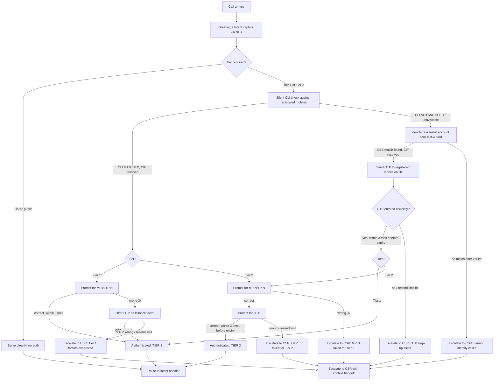

# IVR Authentication Flow — Design

**System**: Conversational IVR, ABC Retail Bank (India)
**Scope**: Caller authentication only — what happens before any account-specific
intent (balance, card block, etc.) is served. Intent handling, RAG/FAQ, and CSR
tooling are out of scope for this doc.
**Status**: Draft for review — see "Open Questions" before build.

## 1. Goals

- Verify a caller is who they claim to be, at a bar appropriate to what they're
  asking for (risk-based, not one-size-fits-all).
- Fail safe: when the IVR can't verify someone with confidence, hand off to a
  CSR rather than guess or loop the caller forever.
- Never let the IVR become a vector for account enumeration or brute-forcing
  MPIN/OTP/card/account numbers.
- Fully voice-native: no DTMF anywhere, including OTP — every sensitive
  digit string is spoken and captured via ASR. Keep sensitive digits (MPIN,
  OTP, card, account) out of persisted call recordings, transcripts, and
  logs despite that (see §10 for how).

## 2. Actors & Integration Points

| Actor | Role |
|---|---|
| Caller | Dials in from any phone |
| Telephony / SIP trunk | Supplies ANI (caller's number) to the IVR platform |
| Conversational IVR platform | ASR/NLU + TTS for the entire conversation, including sensitive digit capture — no DTMF |
| Core Banking System (CBS) | Resolves CIF (customer) from mobile/account/card, validates MPIN/TPIN, returns account status flags (dormant, blocked, watchlist) |
| OTP Gateway | Generates & sends OTP by SMS to a registered mobile, validates entered OTP |
| CSR desktop / CTI | Receives escalated calls with a context handoff (see §9) |
| Fraud/Risk (referenced, not designed here) | Consumes escalation and lockout signals for velocity/anomaly review |

## 3. Terminology

- **ANI / CLI**: the phone number the telephony layer reports for the incoming call.
- **CIF**: Customer Information File — the bank's unique customer record, the thing we're ultimately trying to resolve and authenticate.
- **Registered mobile**: the mobile number(s) on file against a CIF for phone banking.
- **CLI match**: ANI equals a registered mobile number on file for some CIF (passive, no prompt needed).
- **Possession leg**: either a CLI match, or a verified OTP — proof the caller currently has access to the registered mobile.
- **Knowledge factor**: something the caller must know/enter — MPIN/TPIN, OTP, last-4 card, last-6 account.

## 4. Intent → Tier Mapping

The IVR captures intent *before* authenticating, and authenticates at the tier
that intent requires. This avoids over-challenging someone who just wants
branch hours, and avoids under-challenging someone trying to block a card.

| Tier | Examples | Requirement |
|---|---|---|
| **Tier 0 — Public** | Branch/ATM locator, working hours, product FAQ, general complaint intake (no account detail read back) | No authentication |
| **Tier 1 — Self-service, low risk** | Balance inquiry, mini statement, last transaction, cheque status, existing complaint status | Possession leg + 1 knowledge factor (see §6) |
| **Tier 2 — Sensitive** | Card block/hotlist, cheque book request, limit change, dispute/chargeback initiation | Possession leg + MPIN/TPIN **and** OTP (both) |

> Fund transfer and any money-movement intent are assumed **not exposed on
> IVR self-service** at all (route straight to CSR or a separate app/net-banking
> nudge) unless the bank explicitly wants that — flagged in Open Questions.

## 5. Factor Catalog & Strength

| Factor | Kind | Notes |
|---|---|---|
| CLI match | Passive possession | Silent, no prompt. Weak alone (spoofable, shared/office lines) but a strong *positive* signal combined with anything else. |
| OTP (registered mobile) | Dynamic possession | Strongest single factor available on this channel. Used both as the possession leg when CLI doesn't match, and as one of two Tier-2 factors. |
| MPIN/TPIN | Static knowledge | Customer-set secret. Primary Tier-1 knowledge factor when CLI matches. |
| Last-4 card digits | Semi-public identity data | Printed on the physical card, visible on receipts/statements — not a real secret. |
| Last-6 account digits | Semi-public identity data | Printed on cheque books, statements, visible to family/household. |

**Design decision**: last-4 card and last-6 account are treated as an
**identification pair**, not a standalone authentication factor — they're
only strong enough to *look up* who's calling (used together, not alone,
to shrink the collision space), never to *authenticate* them on their own.
This matters specifically for the CLI-mismatch path (§6.2), where the system
doesn't yet know who's calling and needs to resolve a CIF before it can send
an OTP anywhere. If you want them usable as a sole Tier-1 factor, that's a
real security trade-off worth discussing — noted in Open Questions.

## 6. Flow



### 6.1 CLI matched path

1. NLU captures intent → tier determined (§4).
2. CLI silently matches a registered mobile → CIF resolved, no prompt spent on this.
3. **Tier 1**: prompt for MPIN/TPIN, spoken aloud and captured via ASR (see
   §10 for how low-confidence capture is handled before it's even submitted
   for validation). Correct → authenticated. Wrong (up to 3 *validated*
   tries) → offer OTP as a fallback single factor rather than re-prompting
   MPIN indefinitely. OTP correct → authenticated. OTP also exhausted →
   escalate.
4. **Tier 2**: prompt for MPIN/TPIN, then OTP — both required regardless of
   CLI match. CLI match does not reduce the Tier-2 bar; it only means the CIF
   was already known, so no separate identification step is needed.

### 6.2 CLI mismatched / unavailable path

CLI mismatch means the system doesn't yet know who's calling, so it can't
even send an OTP anywhere yet.

1. Ask for last-6 account number **and** last-4 card digits (both, together,
   spoken and captured via ASR) to resolve a CIF via CBS lookup. Max 2
   *validated* attempts — beyond that, the system is effectively being
   probed for a valid account and should stop guessing: escalate to CSR
   rather than retry further.
2. Once CIF is resolved, send OTP to **the registered mobile on file for that
   CIF** — never to the number the caller is actually calling from. Caller
   speaks the OTP back; no DTMF fallback.
3. **Tier 1**: OTP success alone clears the bar (it already covers both the
   possession leg and the single knowledge factor Tier 1 requires).
4. **Tier 2**: OTP success is only the possession leg; MPIN/TPIN is still
   required on top of it, same as the CLI-matched path.
5. No registered mobile on file at all → cannot deliver OTP → escalate
   immediately, don't loop the caller.

## 7. Retry, Resend & Lockout Policy

| Factor | Attempts per call | Resend/regenerate limit | On exhaustion |
|---|---|---|---|
| MPIN/TPIN | 3 | n/a | Offer OTP fallback (Tier 1) or escalate (Tier 2) |
| OTP | 3 verification tries per generated code | 3 resends per call | Escalate to CSR |
| Account+card identification pair | 2 | n/a | Escalate to CSR immediately (enumeration risk) |
| OTP validity window | — | — | 3 minutes, single-use, invalidated by a newer OTP or a resend |

Additional guardrails:
- **Low ASR confidence doesn't count as an attempt.** Since every sensitive
  digit string is now spoken (no DTMF), capture confidence matters: if the
  ASR confidence on a spoken digit string is below threshold, reprompt
  ("I didn't catch that clearly, could you say it again?") *without*
  submitting anything to CBS/OTP gateway and without incrementing the
  attempt count in the table above. Only a confidently-captured value that
  CBS/the OTP gateway actually rejects counts as a used attempt. This keeps
  the brute-force ceiling meaningful while not punishing callers for a bad
  line or an accent the ASR struggles with. Cap soft reprompts too (e.g. 2)
  so a persistently low-confidence line still escalates rather than looping.
- **One escalation-triggering failure per call** — don't let a caller bounce
  between factors indefinitely hunting for a way through; once any
  exhaustion condition in the table above fires, go to CSR.
- **Lockout is CBS's responsibility, not the IVR's** — MPIN/TPIN lock
  thresholds (e.g. N fails across channels → locked until reset) should
  already be enforced by the CBS validate-MPIN API; the IVR just surfaces
  whatever lock status CBS returns and escalates/informs accordingly. Don't
  duplicate lockout logic in the IVR.
- **Velocity flag**: if the same ANI or the same CIF hits an
  escalation-by-exhaustion outcome 3+ times in 24 hours, that's a fraud-review
  signal — out of scope to build here, but the escalation event should be
  logged with enough detail (CIF if known, ANI, tier, which factor failed)
  for a downstream fraud process to pick up.

## 8. Escalation Triggers (all routes to CSR)

- Identification pair (account+card) exhausted with CLI mismatched.
- OTP step-up failed/exhausted (either as the CLI-mismatch replacement, or as
  the second Tier-2 factor).
- MPIN/TPIN failed and no fallback applies (Tier 2), or fallback also failed (Tier 1).
- No registered mobile on file → OTP undeliverable.
- Explicit caller request ("agent", "representative", 0) — global command, valid at any state.
- Repeated ASR no-input/no-match beyond 2 reprompts on any single prompt.
- CBS returns a flagged account (dormant, blocked, watchlist, deceased marker) — escalate silently, don't reveal the reason to the caller.
- Any CBS/OTP-gateway integration timeout or error.

**Context handed to CSR on escalation**: CIF (if resolved), ANI, intent
requested, tier required, which factor(s) were attempted and their
pass/fail, and the specific escalation reason. The CSR still independently
verifies the caller per their own SOP — partial IVR authentication is
context, not a substitute for the CSR's own verification.

## 9. Session / Call Data Model

Fields to track for the duration of a call:

```
session_id
ani                        # raw number from telephony layer
cli_match_result           # MATCHED | NOT_MATCHED | UNAVAILABLE
cif                        # resolved once known, else null
intent                     # captured from NLU
tier_required              # TIER_0 | TIER_1 | TIER_2
auth_status                # NOT_STARTED | IN_PROGRESS | AUTHENTICATED_TIER1 |
                            #   AUTHENTICATED_TIER2 | ESCALATED
factor_attempts[]          # {factor, attempt_count, result, timestamp}
escalation_reason          # null unless escalated
```

Nothing above should ever contain the raw MPIN, OTP, full card number, or
full account number — see §10.

## 10. Security & Compliance Notes

No DTMF anywhere in this flow, including OTP — every sensitive digit string
(MPIN/TPIN, OTP, card, account) is spoken and captured via ASR. That's a
real change to the risk profile versus keypad entry: the secret now exists
in a raw audio waveform, not just a momentary tone, so the compensating
controls below are load-bearing, not optional hardening.

- **Never persist the raw audio for a sensitive-digit turn.** Whatever the
  DTMF pattern used to achieve with pause-and-resume/tone-suppression, do
  the audio equivalent: either don't record the caller's audio track during
  MPIN/OTP/card/account turns at all, or redact (mute/bleep) that segment
  from the stored recording before it's persisted. This is the single most
  important control in this section — everything else assumes it's in place.
  **Confirmed with stakeholders**: the IVR/telephony platform supports
  per-turn recording suppression/redaction, so this control is buildable as
  specified (previously open question, now resolved).
- **No full-text transcripts of sensitive turns.** The ASR pipeline
  necessarily "hears" the full digit string to validate it, but nothing
  downstream — transcript logs, conversation history shown to a CSR,
  analytics — should ever persist that string in full. Store masked forms
  only (e.g. last 2 digits) or just the pass/fail outcome, matching §9's
  data model.
- **Don't read the secret back to confirm it.** A natural conversational
  instinct is "you said 4-2-1-9, is that right?" — don't do this for
  MPIN/OTP/card/account digits, since the TTS confirmation would re-inject
  the secret into any recorded audio and defeats the point of not recording
  the caller's utterance. Use a masked/generic confirmation instead ("Got a
  6-digit code, checking now") and let a wrong answer surface as a failed
  validation rather than a spoken read-back.
- **Caller privacy prompt.** Speaking an OTP/MPIN aloud is audible to anyone
  nearby, unlike keying it in — a risk DTMF didn't have. Consider a brief
  scripted nudge before the first sensitive prompt ("if you're somewhere
  others can overhear, you may want to move somewhere private") — cheap to
  add, meaningfully reduces shoulder-surfing/eavesdropping exposure.
- **Never log full PAN, full account number, MPIN, or OTP** — only masked
  forms (e.g. last 4) and pass/fail outcomes in the session model and logs.
- **DPDP Act 2023 considerations**: call recording requires disclosure/consent
  at greeting; retention limits apply to any stored audio; minimize what's
  persisted beyond the call (the session model in §9 is designed to hold
  nothing raw-sensitive) — now more important than before since the audio
  itself is more sensitive without DTMF's natural masking.
- **No enumeration**: identical, generic failure messaging whether an
  account doesn't exist vs. exists but the factor was wrong — don't let
  response differences become an oracle.
- **Forward-looking option**: since the caller is now always speaking rather
  than keying, this opens the door to passive voiceprint/voice-biometric
  verification as an additional silent factor later — not in scope now, but
  worth designing the session model (§9) with room for a `voice_match_score`
  field if that's on the roadmap.

## 11. Open Questions for Bank Stakeholders

1. Is fund transfer/money-movement in scope for IVR self-service at all, and
   if so what tier/factors? (Assumed out of scope above.)
2. Should last-4 card / last-6 account ever qualify as a *standalone* Tier-1
   factor (not just an identification aid), e.g. for customers without an
   MPIN set up yet? This doc currently says no.
3. What's the actual OTP TTL and resend policy already in use for
   NetBanking/mobile banking — should IVR match it exactly for consistency?
4. Is there an existing CBS "MPIN lock" behavior/threshold the IVR needs to
   surface specific messaging for (e.g. "your MPIN is locked, please visit a
   branch")?
5. Multi-mobile customers: if 2+ mobiles are registered to one CIF, does a
   CLI match on *either* count, and which one receives the OTP in the
   mismatch path?
6. ASR digit-string accuracy in practice (Indian English/Hindi/regional
   accents, mobile network quality) — worth a bench test before committing
   to the attempt/reprompt counts in §7.

## 12. Next Steps

- Confirm §11 with stakeholders.
- Define the CBS and OTP gateway API contracts this flow depends on
  (validate-MPIN, resolve-CIF-by-account-card, send-OTP, validate-OTP,
  get-account-flags).
- Build the authentication state machine (mirrors the deterministic FSM
  pattern used elsewhere in this codebase), with CBS/OTP integrations
  stubbed for now.
- Define the intent→tier mapping as data (not hardcoded), since intents will
  grow.
