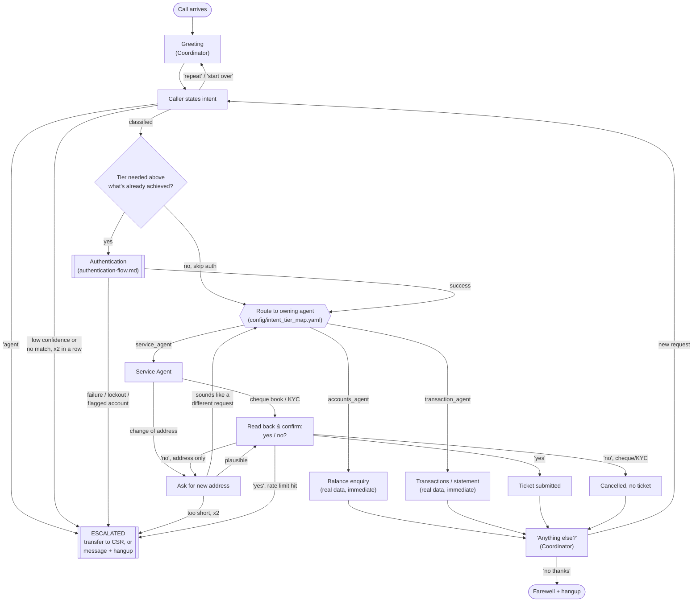

# Call Flow — Current Implementation

A block view of what an actual call does today, end to end. This reflects
the real code (`src/ivr/`), not just the original design intent — see
[`authentication-flow.md`](authentication-flow.md) and
[`agent-architecture.md`](agent-architecture.md) for the detailed spec
behind the "Authentication" and per-agent boxes below.

## Reading this diagram

- **Every arrow into `ESCALATED` is a different reason**, not one path —
  explicit "agent" request, repeated no-match/low-confidence, any auth
  failure (MPIN/OTP exhausted, lockout, flagged account, can't identify
  caller), an implausible address said twice, or hitting the per-call
  service-request rate limit. They all converge on the same outcome: the
  call gets a generic message and either transfers to a CSR number
  (`CSR_TRANSFER_NUMBER`) or just hangs up if none is configured.
- **The "Tier needed > already achieved?" check** is what makes the
  "anything else?" loop cheap for a second Tier 1 request in the same call
  — no re-authentication — while still gating a hypothetical Tier 2 request
  (none exist in the real catalog yet).
- **Service Agent is the only agent with branches** — Accounts and
  Transaction Agent tools execute immediately with no confirmation step,
  since they're read-only. Everything Service Agent does mutates a record,
  so everything there confirms first.
- **"Sounds like a different request"** (mid-address) is the topic-switch
  detection — it re-runs intent classification on what the caller just
  said; if it matches a *different* known intent, control goes back to
  `ROUTE` instead of treating that sentence as the address.
- **Not shown**: the actual telephony mechanics (Twilio `<Gather>`/`<Say>`,
  spoken-digit normalization, the two-turn account+card identification
  split) — those are implementation details of *how* speech gets in and
  out, not the call's decision flow. See `src/ivr/telephony/app.py` for that layer.

## What's still a placeholder

- Intent classification is Groq-based LLM (with a keyword-matching
  fallback) — not a mistake, but worth remembering it's not a hand-built
  NLU model.
- CBS, OTP gateway, and banking data are all dummy/in-memory — no real
  core banking integration exists yet.
- Global commands ("agent"/"repeat"/"start over") are only checked at the
  Coordinator's own intent-capture turn (top of this diagram) — not yet
  during Service Agent's confirmation/address turns further down.
